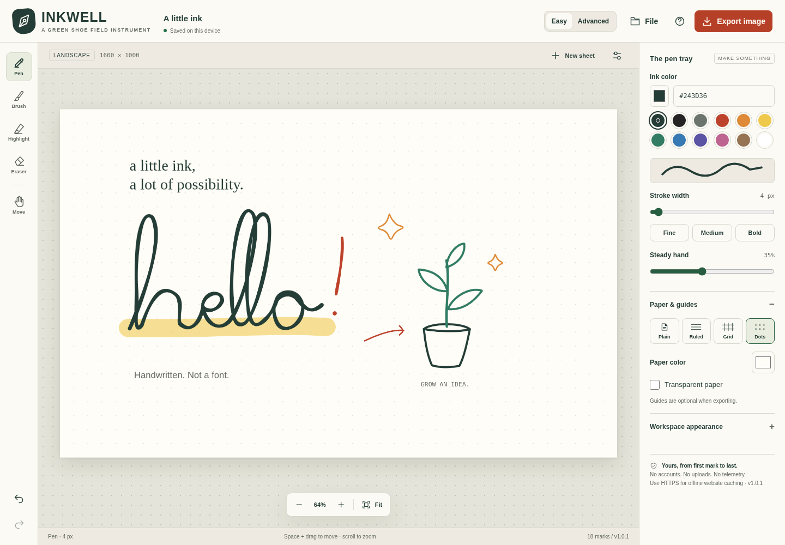
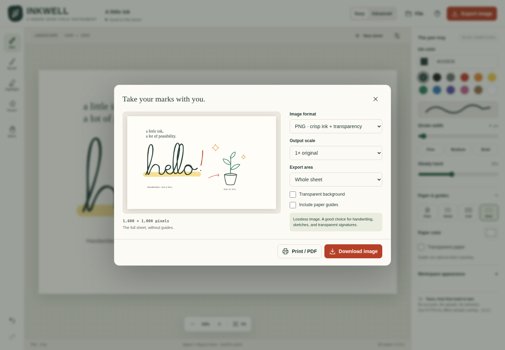
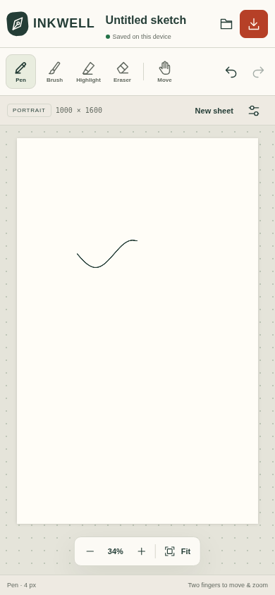

# INKWELL
### A little ink. A lot of possibility.

**A Green Shoe Garage Field Instrument · v1.0.1**

Handwrite notes, draw sketches, make signatures, and export your marks as images. Use a mouse, a finger, or a stylus. The canvas is the main event; the controls stay out of its way.



## Start drawing

**No build step. No account. No runtime dependencies.**

On a desktop, open `index.html` in a current browser. Its HTML, CSS, JavaScript, and interface icons are self-contained. You can also use the separately supplied `INKWELL-v1.0.1.html` portable file; it contains the same application.

For a website, upload these four files together into one directory, such as `/inkwell/`:

```text
index.html
sw.js
manifest.webmanifest
icon.svg
```

Open that directory through your website, with a trailing slash. Relative paths work at the domain root or inside a subdirectory. The app needs no server-side runtime, database, API key, package installation, or compilation. `README.md`, `docs/`, `examples/`, and `tests/` do not need to be uploaded to run it.

For phone or tablet use, open the hosted page in the browser. A file viewer or attachment preview is not necessarily a JavaScript-capable browser. The phone layout starts with portrait paper; desktop starts with landscape paper. A saved project keeps its own dimensions.

The application code in this package has **not** been deployed to a public website for you.

### Updating from v1.0.0

Before replacing anything, use **File → Save editable project** to download a JSON backup. Replace `index.html`, `sw.js`, `manifest.webmanifest`, and `icon.svg` in the same website directory. Reload the page and confirm **v1.0.1** appears in the interface. The service-worker cache version has also been updated. Do not clear site data to update: that can remove the browser's saved drawing.

Schema 1 and the existing storage keys are unchanged, so earlier JSON projects remain compatible. For a portable copy, open the new HTML and import your JSON backup if the browser treats the new file as a separate storage location.

## Draw → export → keep the original

Choose **Pen**, **Brush**, or **Highlight**, then write directly on the paper. Adjust color, width, and **Steady hand** as needed. **Eraser** removes ink to transparency rather than painting white over it.

Press **Export image**, choose a file type, and select **Download image**. A persistent save link appears after preparation, providing a second explicit save action for browsers that do not begin an automatic download. A share button appears only when the browser reports that it can share the generated file.

Use **File → Save editable project** to preserve the editable original as `.inkwell.json`. An image is a finished output, not an editable project backup. **File → Open a project** or dropping an INKWELL JSON file on the canvas restores its paper and marks.

The app does **not** recognize handwriting, convert it into typed text, or authenticate a signature.

## Tools and controls

| Tool | What it does |
| --- | --- |
| Pen | Consistent-width freehand ink with rounded ends. |
| Brush | Variable-width vector strokes. Uses pen pressure when supplied; otherwise drawing speed. Width variation can be turned off. |
| Highlight | Translucent ink, with opacity adjustable in Advanced mode. |
| Eraser | Removes earlier ink. Later marks can be drawn over erased areas. |
| Move | Pans the paper without making a mark. |
| Line / Arrow | Straight annotations; Shift constrains direction. Advanced mode. |
| Box / Oval | Outline or filled shapes; Shift makes a square or circle. Advanced mode. |
| Text | Typed annotations placed where you tap. This is separate from handwriting. Advanced mode. |

**Easy mode** includes the core freehand tools. **Advanced mode** adds shapes, typed annotations, opacity, brush dynamics, guide spacing, and pen-only input. Switching modes does not discard artwork.

Plain, ruled, grid, and dot paper are available, along with custom paper colors and transparent paper. Desktop themes are **Warm light**, **After hours**, and **High contrast**. Theme changes never recolor your exported drawing.

### Mouse, touch, and pen

Draw with the primary mouse button or one finger. Select Move, hold Space while dragging, or use the middle mouse button to pan. Scroll to zoom around the pointer. **Fit** brings the sheet back into view.

Two fingers pan and pinch-zoom. An immediate stationary first contact is treated as a provisional starting dot and discarded when the second finger arrives. If you have already written a line, it is committed before navigation starts rather than erased.

If the browser interrupts drawing, captured points are kept as a partial mark. A missed release is recovered on hover or a new down so it cannot block the next stroke. Use Undo to remove an unwanted partial mark. Escape remains an explicit cancel. These safeguards cannot reconstruct input that a device or browser never delivered.

**Pen-only ink** makes finger input navigate instead of draw. It depends on the browser distinguishing `pen` from `touch`; it is not hardware-level palm rejection. Physical stylus behavior depends on the device and browser.

### Keyboard shortcuts

| Action | Shortcut |
| --- | --- |
| Pen / Brush / Highlight / Eraser | P / B / H / E |
| Move | V, or hold Space |
| Line / Arrow / Box / Oval / Text | L / A / R / O / T |
| Fit sheet | 0 |
| Zoom | + / − |
| Decrease / increase stroke width | [ / ] |
| Undo / Redo | Ctrl or Command + Z / Shift + Z |
| Save editable JSON | Ctrl or Command + S |
| Export image | Ctrl or Command + E |
| Cancel an unfinished mark | Escape |

Text inputs keep their normal text-editing behavior. Surrounding controls are keyboard accessible; freehand drawing itself requires pointing input.

## Image formats

| Format | Transparency | Export behavior |
| --- | --- | --- |
| PNG | Yes | Lossless raster output; useful for crisp handwriting and transparent overlays. |
| JPEG (`.jpg`) | No | Quality-adjustable raster output; flattened onto the selected paper color. |
| WebP | Yes | Quality-adjustable raster output; available only if the current browser can encode it. |
| SVG | Yes | Real vector paths, including brush outlines and eraser masks. Not an embedded PNG. |
| BMP | No | Genuine uncompressed 24-bit bitmap, flattened onto the paper color. Larger files. |

The browser's native PNG, JPEG, and WebP encoders are used. The app detects unavailable codecs and checks the returned MIME type so an unsupported format cannot silently become a PNG with the wrong extension. BMP encoding and SVG generation are implemented locally in the application.

**Whole sheet** preserves the page dimensions. **Crop to ink** measures the visible ink remaining after erasing, then applies adjustable padding within the sheet boundary. An empty cropped drawing falls back to the whole sheet with an explanation.

Use **1×–4× output scale** for a larger raster image. Strokes are re-rendered at the selected size, not merely enlarged from a screenshot. For SVG, this sets the intrinsic image dimensions while keeping vector geometry. Raster exports are limited to 16,777,216 pixels and 8,192 pixels on either side; oversized requests are rejected rather than silently reduced.

Paper guides are **excluded by default**. Enable **Include paper guides** to export them. The transparency checkerboard, application controls, and empty-canvas hint are never part of an export.

**Print / PDF** prepares the artwork for the browser's print dialog. Select a PDF destination there when available. It is not a separate built-in PDF encoder. The print version uses an opaque paper background and the selected crop/guide settings; printing adds no application watermark. The A4 presets match A4's proportions, not a fixed print resolution.



## Recovery, privacy, and offline use

The workspace is autosaved to IndexedDB when available, with localStorage as a startup fallback. The save indicator distinguishes **Unsaved**, **Saving**, **Saved**, and **Not saved**. Storage errors do not disable drawing or JSON export and never produce a false success indicator.

There is one current workspace per browser origin. Another tab saving the workspace triggers a warning. This is not multi-user collaboration or conflict merging.

**Autosave is not a backup.** Private browsing, cleared site data, storage quotas, browser eviction, or switching devices/browsers can remove or isolate saved work. Export JSON regularly. Undo/redo keeps up to 100 transitions in the current session; undo history is not stored in JSON or autosave.

**New sheet**, **Open project**, and **Try a sample** replace the current workspace and can be undone. Opening a project over existing marks asks for confirmation. **Clear ink** retains paper settings and is undoable. **Fresh start** resets the project, history, and preferences after an explicit warning; it is not undoable.

The portable HTML has no external runtime dependencies. For a hosted copy, HTTPS (or localhost during development) enables the supplied service worker to cache the four-file application shell after the first successful visit. Wait for **Offline website cache ready** before relying on a hosted copy without a network connection. Actual cache retention remains under browser control.

There are no accounts, analytics, drawing uploads, remote fonts, CDNs, or external drawing services. Hosted use still makes ordinary requests to your own server to load/update the application shell. The offline cache is scoped to the deployment directory and does not intercept other websites or non-GET requests.



## Project safety and limits

Imports are validated completely before replacing the current drawing. Unknown schemas, unsupported mark types, invalid colors, non-finite coordinates, malformed JSON, oversized files, and excessive point counts are rejected. Text is treated as text, not executable HTML or SVG.

The app accepts INKWELL JSON only. PNG, JPEG, WebP, SVG, and BMP are **export formats**, not importable editable projects in this release. There are no image layers, selection/move operations for individual marks, or multi-page documents yet.

Paper dimensions are 100–4,096 pixels per side, with at most 12,582,912 pixels. Projects have a maximum of 5,000 marks, 400,000 stroke points total, and 20,000 points per stroke. Imported JSON files are limited to 25 MB. Coordinates and pressure values are normalized to the application's hundredth-unit representation. JSON downloads are compact to keep large projects within the import-size envelope.

SVG hand-drawn marks are vector paths. Typed SVG annotations use system fonts, so their appearance can differ between devices. Very long projects and many successive erasures can make rendering and SVG export slower. Low-memory devices may need a lower export scale even within the configured safety limits.

## Files

```text
index.html                        Complete application; inline CSS and JavaScript
sw.js                             Scoped offline application-shell cache
manifest.webmanifest              Installable-web-app metadata
icon.svg                          Application icon
README.md                         Usage and deployment guide
CHANGELOG.md                      Implemented release history
ROADMAP.md                        Ideas for later releases, not implemented features
docs/
  desktop.png                     Actual browser-rendered workspace
  mobile.png                      Actual browser-rendered phone layout
  export.png                      Export dialog screenshot
  mobile-export.png               Phone export dialog screenshot
  TEST-REPORT.md                   Test coverage and explicit limitations
  PROJECT-FORMAT.md                JSON structure and developer notes
examples/
  a-little-ink.inkwell.json        Editable built-in sample
  export-validation.inkwell.json  Small erasing/transparency fixture
tests/
  test_inkwell.py                  Browser/UI/export regression checks
  test_input_regressions.py        Input lifetime and interruption regressions
  input-results.json              v1.0.1 input verification
  input-baseline-v1.0.0.json       The same cases run against the previous release
  test_service_worker.mjs         Offline-cache logic checks with adapters
  results.json                    Recorded UI/export check results
```

## Development and verification

No tools are needed to run the app. For development, a simple static server is enough:

```sh
python -m http.server 8000
```

For automated browser testing, use Python with Playwright and Pillow:

```sh
python -m pip install playwright pillow
python -m playwright install chromium
python tests/test_inkwell.py
python tests/test_input_regressions.py --browser /path/to/chromium
```

A system Chromium can be selected with `--browser /path/to/chromium`. A restricted environment that blocks navigation can use `--sandbox`; that mode renders the same HTML directly and substitutes storage/download adapters. It is not a substitute for real persistence or device tests.

Run the separate offline-shell logic checks with Node.js 18 or newer:

```sh
node tests/test_service_worker.mjs
```

The included run passed **33 focused input regressions, 66 browser/UI/export checks, and 11 offline-shell logic checks**. The browser run used sandbox adapters for storage and file-save delivery. Native service-worker installation, native durable storage, OS save/share/print dialogs, and physical iPhone/Safari behavior are not verified by that run. See [the complete test report](docs/TEST-REPORT.md).

To update a deployed release, increment the visible application version, service-worker cache version, manifest/metadata as appropriate, and changelog. Keep the four deployment files together. A restrictive hosting Content Security Policy must permit the application's inline script and style, or those must be externalized as a separate deployment change.

## Implementation references

The runtime bundles no third-party libraries. The browser APIs used are documented in these primary references:

- [W3C: Pointer Events Level 3](https://www.w3.org/TR/pointerevents3/)
- [MDN: Pointer events](https://developer.mozilla.org/en-US/docs/Web/API/Pointer_events)
- [MDN: pointercancel](https://developer.mozilla.org/en-US/docs/Web/API/Element/pointercancel_event)
- [MDN: lostpointercapture](https://developer.mozilla.org/en-US/docs/Web/API/Element/lostpointercapture_event)
- [MDN: coalesced input events](https://developer.mozilla.org/en-US/docs/Web/API/PointerEvent/getCoalescedEvents)
- [MDN: Canvas toBlob and codec fallbacks](https://developer.mozilla.org/en-US/docs/Web/API/HTMLCanvasElement/toBlob)
- [MDN: Service workers](https://developer.mozilla.org/en-US/docs/Web/API/Service_Worker_API/Using_Service_Workers)

## License

Copyright (C) 2026 Michael Parks / Green Shoe Garage. INKWELL source is licensed under **GNU General Public License version 3 only** (`GPL-3.0-only`). See [LICENSE](LICENSE) for the full terms. No warranty is provided. Artwork you create is not automatically licensed under the application source license.
